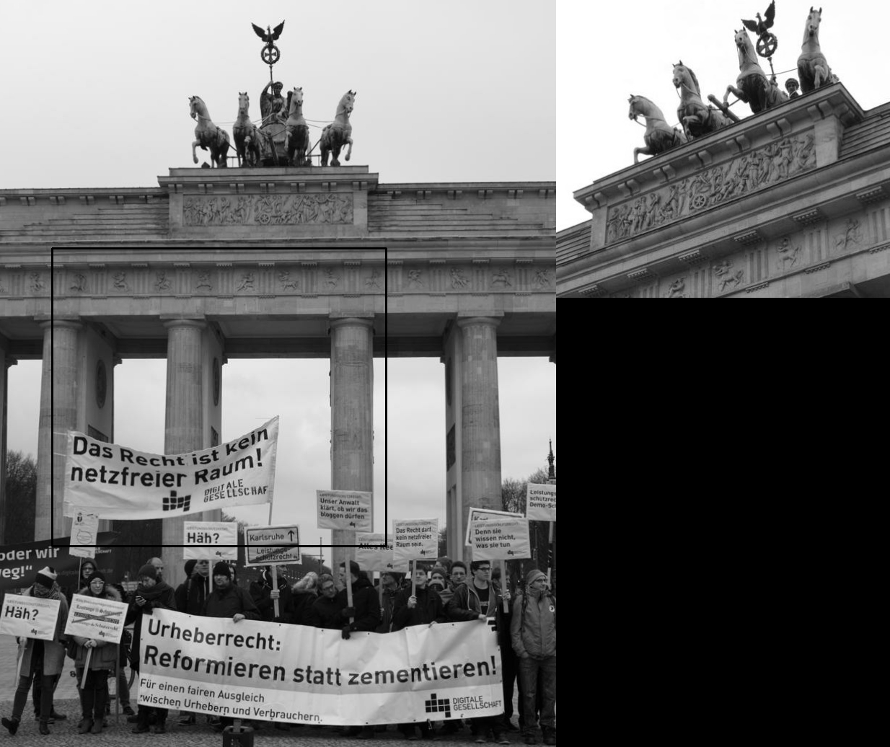
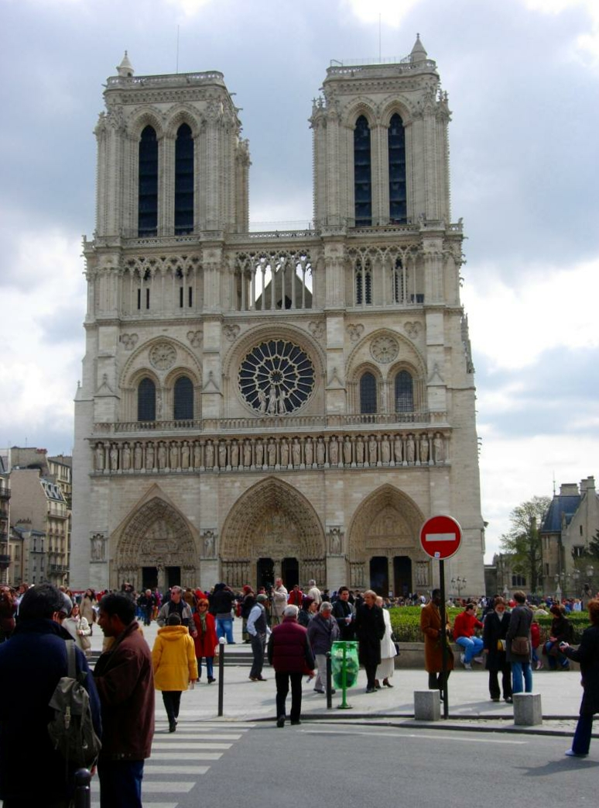
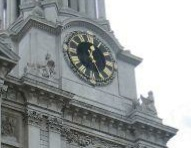

# itmo_cv_lab2
# Теоретическая база  
### Template Matching 
Сопоставление шаблонов - это процесс перемещения шаблона по всему изображению и вычисления сходства между шаблоном и участком изображения. Участок с наибольшим сходством считается участком где находится искомый объект. В данной работе в качестве меры сходства используется L1 расстояние.

### Использование детекторов и дескрипторов локальных признаков
Детектор находит ключевые точки (keypoint), это точки которые наиболее устойчивы к различным трансформациям. Далее, мы вычисляет дескрипторы окрестностей этих точек. Сравнивая дескрипторы, можно определить, насколько схожи окрестности ключевых точек.
В данной работе используется детектор DoG и дескриптор HardNet8[1]. Для матчинга используется метод smnn (second mutual nearest neighbor). Применяется библиотека Kornia[2]

# Описание разработанной системы
Была написана программа на языке Python, которая реализует поиск с помощью template matching и с помощью сравнения локальных признаков. 

# Результаты работы и тестирования системы
Исходное изображение  
   
Шаблон  
   
Результаты Template matching  
  
Результаты DoG+HardNet8   
 
  
Исходное изображение  
   
Шаблон  
   
Результаты Template matching  
  
Результаты DoG+HardNet8   
 
 
Исходное изображение  
   
Шаблон  
   
Результаты Template matching  
  
Результаты DoG+HardNet8   
 
  
Исходное изображение   
   
Шаблон  
   
Результаты Template matching  
  
Результаты DoG+HardNet8   
 
 
Исходное изображение   
   
Шаблон  
   
Результаты Template matching  
  
Результаты DoG+HardNet8    
 
  
Исходное изображение  
   
Шаблон  
   
Результаты Template matching  
  
Результаты DoG+HardNet8   
Не нашел матчей
 
Исходное изображение  
   
Шаблон  
   
Результаты Template matching  
  
Результаты DoG+HardNet8   
 
 
Исходное изображение  
   
Шаблон  
   
Результаты Template matching  
  
Результаты DoG+HardNet8   
 
 
Исходное изображение  
   
Шаблон  
   
Результаты Template matching  
  
Результаты DoG+HardNet8  
Только 1 матч, нельзя построить прямоугольник  
 
 
Исходное изображение  
   
Шаблон  
   
Результаты Template matching  
  
Результаты DoG+HardNet8   
 
 
# Выводы по работе
В результате работы алгоритмов, можно заметить, что локальных признаки гораздо более гибкие и работают гораздо точнее. Их минусом является высокие требования к вычислительным ресурсам и медленная скорость работы. 

# Использованные источники
[1] https://arxiv.org/pdf/2007.09699.pdf
[2] https://kornia.readthedocs.io/en/latest/index.html
